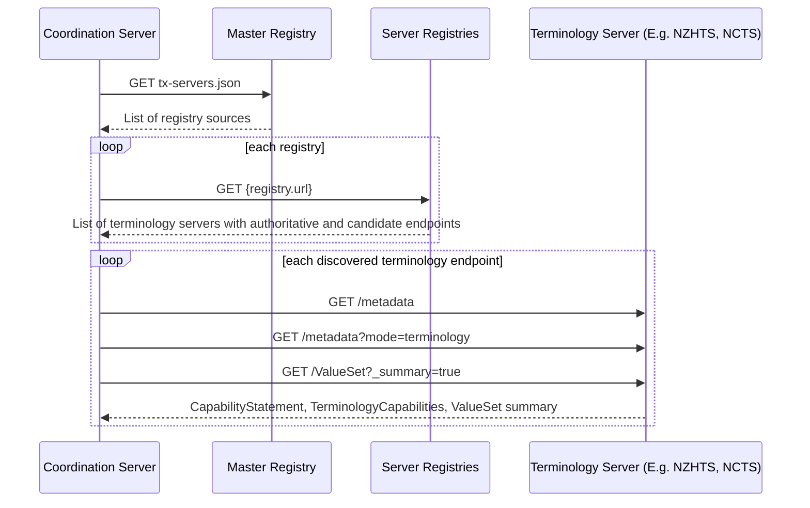
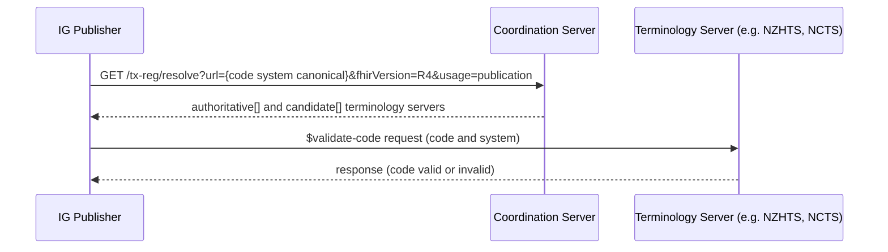

# Data Standards Workshop: Using SNOMED national editions with the IG publisher 
aka **Don’t Let Your IG Burn Down: Validating the SNOMED NZ Edition with the IG Publisher and NZHTS**

This track will provide:
- a very brief overview of the FHIR terminology ecosystem (below on this page)
- an example IG using an exp-params.json to ensure a specific authoritative server is used 
- guidance on how to use NZHTS for validation of SNOMED NZ edition

## The FHIR Terminology Ecosystem Framework

The FHIR Terminology Ecosystem provides a standard way for the HL7 FHIR IG Publisher to discover which FHIR terminology server can validate, expand, or analyze codes from a given CodeSystem or ValueSet. 

Instead of relying on a single central server, the ecosystem allows many terminology servers, each responsible for local content, to register in a shared registry. A coordination server regularly scans these servers and catalogs which ones support which terminologies, and whether they are considered authoritative sources.

When the IG Publisher needs to validate codes, it queries the coordination server, which responds with the best server(s) to use for the specific terminology and version required. If a server is marked as authoritative for a CodeSystem, it is the server used to validate codes from that system. This approach decentralizes terminology management so that tx.fhir.org does not need to know about all of the details of regionalised/localised terminology, to allow it to be validated via the IG publisher. 

### Coordination server background processes to scan registry

The diagrams below sumamrise the processes described in the [ecosystem documentation](https://hl7.org/fhir/uv/tx-ecosystem/ecosystem.html). Note that currently the tx server registry is manually updated to add servers by contributors adding their own and HL7 (Mostly Grahame managing/approving).



### IG Publisher resolution of which terminology server to use
When the IG publisher is run, it queries the Coordination server to find out how to handle a given CodeSystem. The main tx.fhir.org still handles many of the standard bindings, but things like SNOMED national editions have alternative authoratiative servers (such as NCTS for the Australian Edition, and NZHTS for the NZ edition).



### Specifying a SNOMED edition for resolution of implicit SNOMED ValueSets in an IG

SNOMED ValueSets as used in FHIR IGs are often defined using implicit ValueSets. An implicit ValueSet has two parts:
- a base URL (which may be http://snomed.info/sct to indicate an unspecified edition or version or the URI for the edition version)
- a query portion that defines the scope of what is included in the ValueSet

Using a base URL of http://snomed.info/sct defines an incomplete ValueSet whose membership will depend on the edition used when it is expanded. The default behaviour defined for a FHIR terminology service is to use the latest available version of its default version (or the International edition if no other addition is the default).

To avoid this ambiguity in a FHIR IG, you can define the edition to use, by providing the edition URL in a Parameters resource. This should be included in the IG's folder structure with the name/location of:  `input/_resources/exp-params.json`. For the NZ Edition of SNOMED this file looks like: 


````json
{
  "resourceType": "Parameters",
  "id": "exp-params",
  "parameter": [
    {
      "name": "system-version",
      "valueUri": "http://snomed.info/sct|http://snomed.info/sct/21000210109"
    }
  ]
}
````


### Example IG

Link: